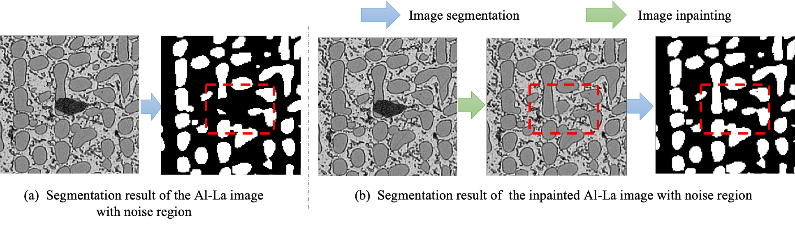
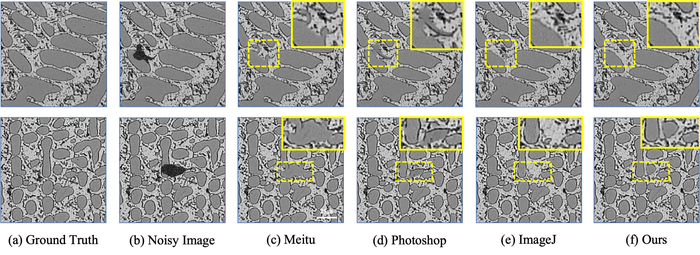

# Automatic Inpainting

An open source framework for automatic inpainting task, with the support of [Deep Learning based Automatic Inpainting for Material Microscopic Images]().





## Getting Started

### 1) Requirements:

- Install python3.
- Install [pytorch](https://www.pytorch.org) (tested on Release 1.3.0, 1.4.0, 1.5.0).

### 2) Training:

- Prepare training images files
- Run `python train.py`

### 3) Inference:

- Run `python inference.py --checkpoints ./checkpoints --input ./example/micro.jpg --output ./results`

## Pretrained Models

Our pretrained models is available at https://drive.google.com/open?id=1agv7jaHJ6HdGgfS4nH6VOAjR2Hfx6-qo

## License

[MIT](https://github.com/ustb-ai3d/LICENSE)

## Citing
```
@article{gao2020automatic,
  title={Deep Learning based Automatic Inpainting for Material Microscopic Images},
  author={Gao, Mingfei and Ma, Bin and Wang, Zixuan and Ma, Boyuan and Ban, Xiaojuan and Huang, Haiyou and Wu Weiheng},
  journal={},
  year={2020}
}
```

## Reference

- [Pytorch-UNet](https://github.com/milesial/Pytorch-UNet)
- [edge-connect](https://github.com/knazeri/edge-connect)